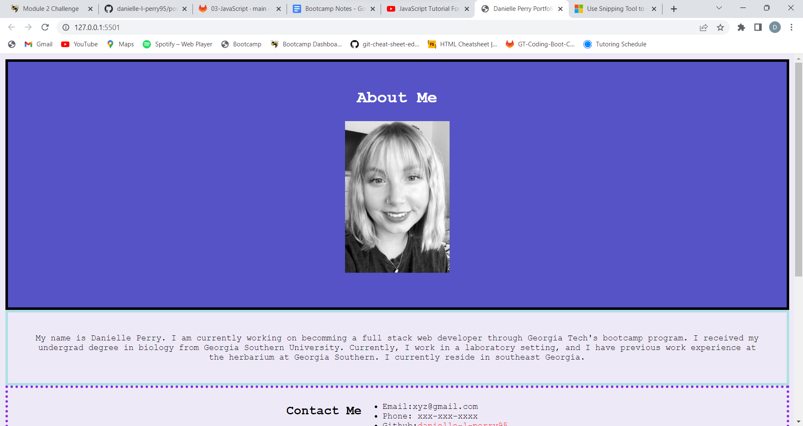
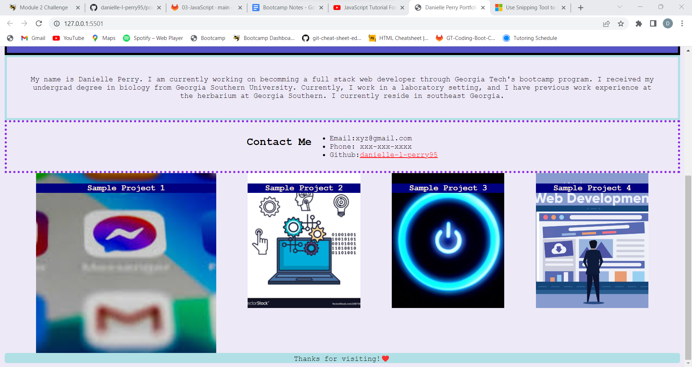

# Danielle Perry's Portfolio Website

## Description
* This project is an example website to show an individual's web development projects. Once this website includes actual links to the 
individual's projects, employeers can utilize this to make hiring decisions. The website includes a photo of the individual, a contact me section, photos of example projects that are clickable, and a footer. This project utilizes media queries, so feel free to adjust the viewport size to see what changes. 

### Skills
* Flexbox
* Media Queries
* CSS
* Wireframing

#### Links
danielle-l-perry95.github.io/portfolio-02-challenge
https://github.com/danielle-l-perry95/portfolio-02-challenge

